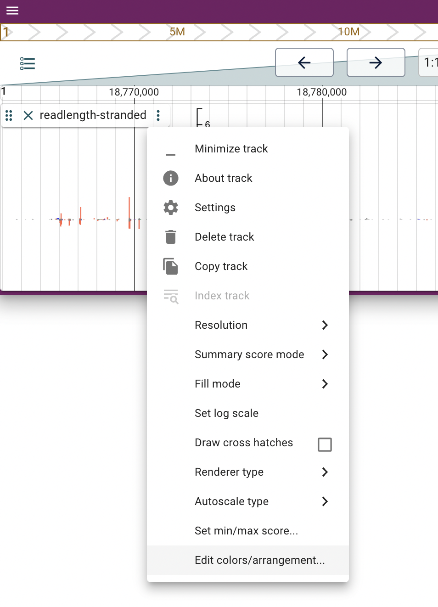
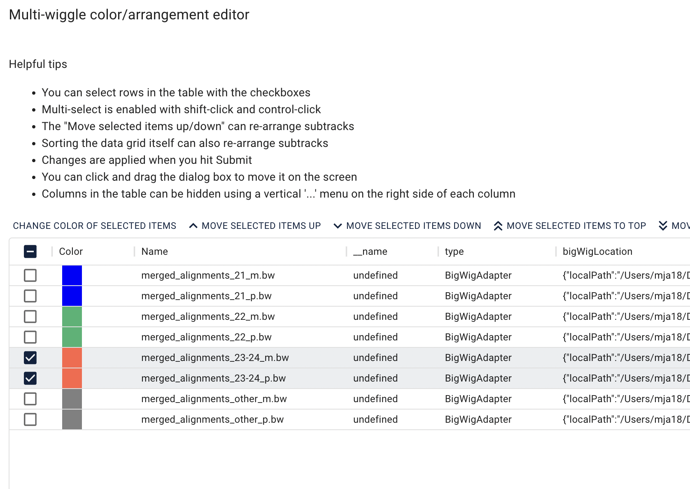
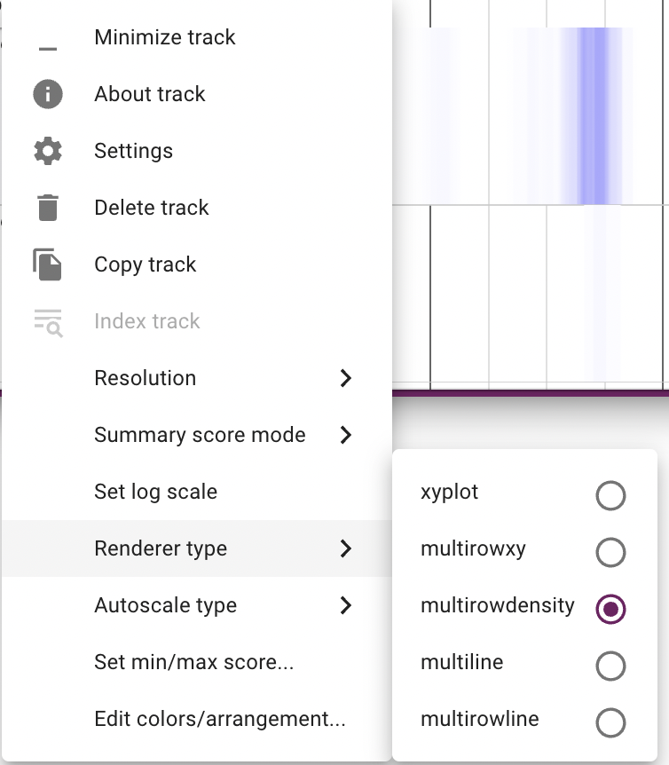

# ShortTracks
Useful length- and strand-based coverage files (bigwig) from small RNA-seq alignments (BAM)

# Author
Michael J. Axtell, The Pennsylvania State University, mja18@psu.edu

# Synopsis
Flexible conversion of BAM-formatted alignment into one or more bigwig coverage files, based on query lengths or readgroups and strandedness. Especially useful when viewed with the JBrowse2 <https://jbrowse.org/jb2/> multi-wiggle track feature.

# Install
## Install with conda
*operational soon*
Install `conda` with the bioconda <https://bioconda.github.io> channel properly configured, then:

## Linux, Intel-based Macs
```
conda install shorttracks
```

## Silicon-based Macs

Not all dependencies are available for Silicon-based Macs at this time, so the following work around is required
```
conda create --name shorttracks
conda activate shorttracks
conda config --env --set subdir osx-64
conda install shortstracks
```

## Manual install
First install dependencies / create an environment with these in the path
- `python` (>=3.10)
- `samtools` (>= 1.10) <https://www.htslib.org>
- `wigToBigWig` <https://genome.ucsc.edu/goldenPath/help/bigWig.html>

Then, copy the `ShortTracks` script somewhere to your $PATH or environment.

# Usage
`ShortTracks [-h] [--version] [--mode {simple,readgroup,readlength}] [--stranded] --bamfile BAMFILE`

## Options

- `-h` : Display help message then quit
- `--version` : Display version information then quit
- `--mode` : Set the mode. Either `simple`, `readgroup`, or `readlength`. Defaults to `simple`
- `--stranded` : If set, create a plus and minus-strand track for each trim.
- `--bamfile` (required) : Path to the bamfile being processed

## Modes
### simple
The simple mode (the default) processes the entire bam file (i.e. no splitting by read group or by read length.
### readgroup
If separate files for each readgroup are produced. The denominator for the read-per-million calculation is based on the total reads in each read group (so the resulting values are comparable between readgroups).
### readlength
Four separate files, based on read lengths, are produced: 21, 22, 23-24, and all others. These size separations mirror functionally distinct types of small RNAs from plants.

# Common views
## Using read lengths


`ShortTracks --bamfile yourreads.bam --mode readlength --stranded`

This will create 8 different bigwig files: 21, 22, 23-24, and other, with plus and minus strands for each. All are normalized to reads per million with respect to the entire original file.

Load onto jBrowse2: add track --> multi-wiggle track

In the track settings, set renderer type to 'xyplot':


Then in the track settings, choose Edit colors/arrangement:



Set the colors and order like so:
- 21 plus and minus: blue
- 22 plus and minus: mediumseagreen
- 23-24 plus and minus: tomato
- other : gray



Then you have a track that looks like:


The xyplot is subject to overplotting. With the suggested settings the other (gray) is on top, followed by 23-24 (tomato), then 22 (mediumseagreen), and 21 on the bottom (blue). If overplotting is a concern, you can change the renderer type to 'multiline':


## Using read groups

When you have a single bam file that contains reads from multiple different samples, and the samples have different readgroup (RG) tags:

`ShortTracks --bamfile yourreads.bam --mode readgroup`

This creates a separate bigwig file for each readgroup that is present (job will abort if the bam file contains no read groups).

The reads-per-million scale of each read group file separate .. so that the final outputs are fair comparsions of normalized coverage between the different samples. This is useful for visually ascertaining differences in accumulation between samples.

Load the files into jBrowse2 as a multi-wiggle track, and then set the renderer type to 'multirowdensity':



This shows quickly differences in normalized coverage among the various readgroups. The example image below shows only two readgroups.


# How it works
1. Raw depths by chromosomal position are first calculated using `samtools` and written to disk.
2. Depths are converted to reads per million and then re-formatted into wiggle files.
3. The wiggle files are converted to bigwig files.


